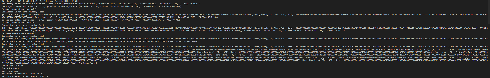

# API Testing Demo Results

## 1. Health Check
**Endpoint**: `/api/health` (GET)

### Test Script
```powershell
$uri = "http://localhost:5000/api/health"
try {
    $response = Invoke-WebRequest -Uri $uri -Method Get
    Write-Host "Health Check Response:"
    Write-Host "Status Code: $($response.StatusCode)"
    Write-Host "Content: $($response.Content)"
} catch {
    Write-Host "Error:"
    Write-Host $_.Exception.Message
}
```

### Execution Output
```console
PS C:\Users\krasn\WindowsProjects\geescan> $uri = "http://localhost:5000/api/health"
>> try {
>>     $response = Invoke-WebRequest -Uri $uri -Method Get
>>     Write-Host "Health Check Response:"
>>     Write-Host "Status Code: $($response.StatusCode)"
>>     Write-Host "Content: $($response.Content)"
>> } catch {
>>     Write-Host "Error:"
>>     Write-Host $_.Exception.Message
>> }
Health Check Response:
Status Code: 200
Content: {
  "status": "healthy"
}
```

## 2. Test Create AOI
**Endpoint**: `/api/test_create_aoi` (POST)

### Test Script
```powershell
$uri = "http://localhost:5000/api/test_create_aoi"
try {
    $response = Invoke-WebRequest -Uri $uri -Method Post
    Write-Host "Test Create AOI Response:"
    Write-Host "Status Code: $($response.StatusCode)"
    Write-Host "Content: $($response.Content)"
} catch {
    Write-Host "Error:"
    Write-Host $_.Exception.Message
}
```

### Execution Output
```console
PS C:\Users\krasn\WindowsProjects\geescan> $uri = "http://localhost:5000/api/test_create_aoi"
>> try {
>>     $response = Invoke-WebRequest -Uri $uri -Method Post
>>     Write-Host "Test Create AOI Response:"
>>     Write-Host "Status Code: $($response.StatusCode)"
>>     Write-Host "Content: $($response.Content)"
>> } catch {
>>     Write-Host "Error:"
>>     Write-Host $_.Exception.Message
>> }
Test Create AOI Response:
Status Code: 201
Content: {
  "id": 5,
  "message": "Test AOI created successfully"
}
```

## 3. Test Get AOIs
**Endpoint**: `/api/test_aois` (GET)

### Test Script
```powershell
$uri = "http://localhost:5000/api/test_aois"
try {
    $response = Invoke-WebRequest -Uri $uri -Method Get
    Write-Host "Status Code: $($response.StatusCode)"
    Write-Host "Content: $($response.Content)"
} catch {
    Write-Host "Error: $($_.Exception.Message)"
}
```

### Execution Output
```console
PS C:\Users\krasn\WindowsProjects\geescan> Write-Host "--- Testing /api/test_aois (GET) ---"
>> $uri = "http://localhost:5000/api/test_aois"
>> try {
>>     $response = Invoke-WebRequest -Uri $uri -Method Get
>>     Write-Host "Status Code: $($response.StatusCode)"
>>     Write-Host "Content: $($response.Content)"
>> } catch {
>>     Write-Host "Error: $($_.Exception.Message)"
>> }
>> Write-Host ""
--- Testing /api/test_aois (GET) ---
Status Code: 200
Content: {
  "aois": [
    {
      "geometry": "{\"type\":\"Polygon\",\"coordinates\":[[[-74.006,40.7128],[-74.0065,40.7128],[-74.0065,40.7123],[-74.006,40.7123],[-74.006,40.7128]]]}",
      "id": 1,
      "name": "Test AOI"
    },
    {
      "geometry": "{\"type\":\"Polygon\",\"coordinates\":[[[-74.006,40.7128],[-74.0065,40.7128],[-74.0065,40.7123],[-74.006,40.7123],[-74.006,40.7128]]]}",
      "id": 2,
      "name": "Test AOI"
    },
    {
      "geometry": "{\"type\":\"Polygon\",\"coordinates\":[[[-74.006,40.7128],[-74.0065,40.7128],[-74.0065,40.7123],[-74.006,40.7123],[-74.006,40.7128]]]}",
      "id": 3,
      "name": "Test AOI"
    },
    {
      "geometry": "{\"type\":\"Polygon\",\"coordinates\":[[[-74.006,40.7128],[-74.0065,40.7128],[-74.0065,40.7123],[-74.006,40.7123],[-74.006,40.7128]]]}",
      "id": 4,
      "name": "Test AOI"
    },
    {
      "geometry": "{\"type\":\"Polygon\",\"coordinates\":[[[-74.006,40.7128],[-74.0065,40.7128],[-74.0065,40.7123],[-74.006,40.7123],[-74.006,40.7128]]]}",
      "id": 5,
      "name": "Test AOI"
    },
    {
      "geometry": "{\"type\":\"Polygon\",\"coordinates\":[[[-74.006,40.7128],[-74.0065,40.7128],[-74.0065,40.7123],[-74.006,40.7123],[-74.006,40.7128]]]}",
      "id": 6,
      "name": "Test AOI"
    }
  ],
  "message": "Successfully fetched AOIs"
}

## 4. Get All AOIs
**Endpoint**: `/api/aois` (GET)

### Test Script
```powershell
$uri = "http://localhost:5000/api/aois"
try {
    $response = Invoke-WebRequest -Uri $uri -Method Get
    Write-Host "Status Code: $($response.StatusCode)"
    Write-Host "Content: $($response.Content)"
} catch {
    Write-Host "Error: $($_.Exception.Message)"
}
```

### Execution Output
```console
PS C:\Users\krasn\WindowsProjects\geescan> try {
>>     $response = Invoke-WebRequest -Uri $uri -Method Get
>>     Write-Host "Status Code: $($response.StatusCode)"
>>     Write-Host "Content: $($response.Content)"
>> } catch {
>>     Write-Host "Error: $($_.Exception.Message)"
>> }
Status Code: 200
Content: {
  "aois": [
    {
      "geometry": "{\"type\":\"Polygon\",\"coordinates\":[[[-74.006,40.7128],[-74.0065,40.7128],[-74.0065,40.7123],[-74.006,40.7123],[-74.006,40.7128]]]}",
      "id": 1,
      "name": "Test AOI"
    },
    {
      "geometry": "{\"type\":\"Polygon\",\"coordinates\":[[[-74.006,40.7128],[-74.0065,40.7128],[-74.0065,40.7123],[-74.006,40.7123],[-74.006,40.7128]]]}",
      "id": 2,
      "name": "Test AOI"
    },
    {
      "geometry": "{\"type\":\"Polygon\",\"coordinates\":[[[-74.006,40.7128],[-74.0065,40.7128],[-74.0065,40.7123],[-74.006,40.7123],[-74.006,40.7128]]]}",
      "id": 3,
      "name": "Test AOI"
    },
    {
      "geometry": "{\"type\":\"Polygon\",\"coordinates\":[[[-74.006,40.7128],[-74.0065,40.7128],[-74.0065,40.7123],[-74.006,40.7123],[-74.006,40.7128]]]}",
      "id": 4,
      "name": "Test AOI"
    },
    {
      "geometry": "{\"type\":\"Polygon\",\"coordinates\":[[[-74.006,40.7128],[-74.0065,40.7128],[-74.0065,40.7123],[-74.006,40.7123],[-74.006,40.7128]]]}",
      "id": 5,
      "name": "Test AOI"
    },
    {
      "geometry": "{\"type\":\"Polygon\",\"coordinates\":[[[-74.006,40.7128],[-74.0065,40.7128],[-74.0065,40.7123],[-74.006,40.7123],[-74.006,40.7128]]]}",
      "id": 6,
      "name": "Test AOI"
    }
  ],
  "message": "Successfully fetched AOIs"
}

## Screenshot of Test Results

